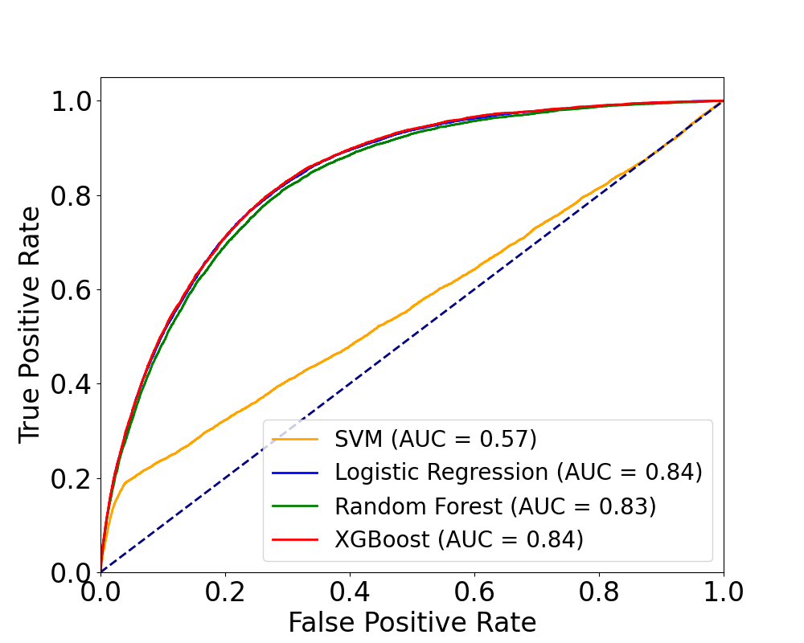

# Heart-Disease-Analysis-Kaggle-

## Introduction
This study leverages machine learning techniques to develop predictive models for heart disease using epidemiological data from the CDC's Behavioral Risk Factor Surveillance System (BRFSS). The dataset encompasses 319,795 records across 169 variables related to demographics, lifestyle factors, and medical history. After pre-processing the raw data, two algorithms - Logistic Regression and Random Forest - are employed to construct classification models with the binary target variable of heart disease presence. The study maintains key assumptions underlying these methods regarding relationships, variable independence, model robustness, and feature relevance. Data analysis is conducted, including exploratory analysis and quadratic/interaction term generation, to capture potential non-linearities. The anticipated results exceed 90\% accuracy, with Random Forest likely outperforming Logistic Regression. By unraveling the risk profile of heart disease, this research aims to equip healthcare practitioners with personalized assessment tools to curb the incidence and burden of cardiovascular mortality. The methodology and large-scale real-world dataset offer insights for improving preventive strategies.

## Models and Results
We trained Support Vector Machine, Logistic Regression, Random Forest, and XGBoost on the data. Our results are shown as follow:

1. **Table 1: Comparative Overview of Confusion Matrices for Various Classifier Models**

   ```markdown
   | Model               | TN    | FP  | FN   | TP  |
   |---------------------|-------|-----|------|-----|
   | SVM                 | 87649 | 0   | 8290 | 0   |
   | Logistic Regression | 86936 | 713 | 7515 | 775 |
   | Random Forest       | 87389 | 260 | 7927 | 363 |
   | XGBoost             | 87081 | 568 | 7610 | 680 |
   ```
   *Detailing True Negative (TN), False Positive (FP), False Negative (FN), and True Positive (TP) Counts*

2. **Table 2: Comparative Analysis of Classifier Performance Metrics**

   ```markdown
   | Metric     | SVM     | Logistic Reg. | RF     | XGBoost |
   |------------|---------|---------------|--------|---------|
   | Accuracy   | 0.9136  | 0.9142        | 0.9147 | 0.9148  |
   | Precision  | 0.0000  | 0.5208        | 0.5827 | 0.5449  |
   | Recall     | 0.0000  | 0.0935        | 0.0438 | 0.0820  |
   | Specificity | 1.0000 | 0.9919        | 0.9970 | 0.9935  |
   | F1 Score   | 0.0000  | 0.1585        | 0.0815 | 0.1426  |
   ```
   *'Logistic Reg.' denotes Logistic Regression and 'RF' refers to Random Forest.*

3. **Receiver Operating Characteristic Curves of SVM, Logistic Regression, Random Forest, and XGBoost Algorithms**
   

4. **Comparison of Top-Ranked Features in Random Forest (RF) and XGBoost (XGB) Models.**
```markdown
| Feature (RF)                  | Feature (XGB)                    |
|-------------------------------|----------------------------------|
| AgeCategory                   | AgeCategory                      |
| GenHealth                     | GenHealth                        |
| Diabetic                      | Diabetic                         |
| BMI_x_DiffWalking             | -                                |
| BMI_x_Stroke                  | -                                |
| Stroke_x_SleepTime            | -                                |
| DiffWalking                   | DiffWalking                      |
| BMI_x_SleepTime               | -                                |
| DiffWalking_x_SleepTime       | DiffWalking_x_SleepTime          |
| BMI_x_Sex                     | -                                |
| -                             | Smoking_x_Sex                    |
| -                             | Stroke_x_DiffWalking             |
| -                             | Sex_x_Race_White                 |
| -                             | DiffWalking_x_KidneyDisease      |
| -                             | Stroke                           |
```

*Features are Presented in Descending Order of Their Respective Importance.*

## Conclusions
In the context of heart disease detection, Recall (Sensitivity) emerges as the paramount metric due to its role in accurately identifying true cases of the disease. This prioritization stems from the greater risk associated with false negatives (missed heart disease cases) compared to false positives (incorrectly diagnosed cases).

Upon reviewing the data, Logistic Regression stands out as the most suitable model, primarily because of its relatively higher recall, which is vital for maximizing the detection of true positive cases. However, it is important to acknowledge that all models exhibit room for improvement in recall. This observation underscores the need for potential enhancements through model tuning, data sampling adjustments, or the exploration of alternative modeling approaches to bolster recall performance.

From a statistical perspective, Logistic Regression is also favored due to its impressive balance of high performance and relatively lower complexity, as evidenced by its ROC curves and AUC scores. This dual consideration of effectiveness and simplicity further solidifies its selection as the preferred model for this application.

To identify the key factors influencing heart disease, we focus on the shared top-ranked features in terms of feature importance from both the Random Forest and XGBoost models, given their comparable performance to the Logistic model. The findings highlight the importance of an individual's age, general health status, diabetic condition, difficulty in walking, and average sleep duration, particularly in relation to walking difficulties, as significant determinants of heart health.
